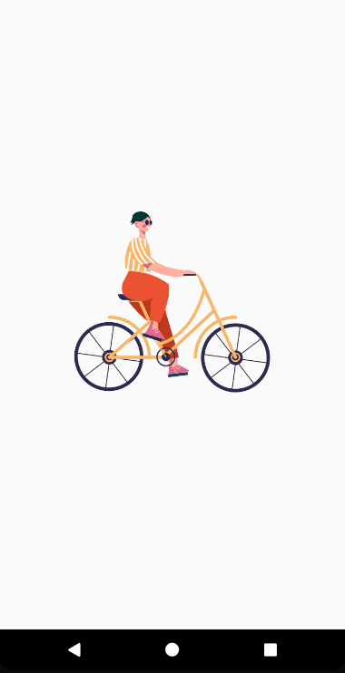

<h1 align="center">
  Apply Lottie
   
</h1>

  
  

## 📅 Sobre

Mobile - Aplicando o Lottie, lottie-react-native é uma biblioteca móvel para Android e iOS que analisa animações do Adobe After Effects exportadas como JSON com bodymovin e as renderiza nativamente no celular! Pela primeira vez, os designers podem criar e enviar belas animações sem um engenheiro recriá-las meticulosamente à mão. E react-lottie para ReactJS.

## 🌐 Tecnologias Usadas
Foram usadas essas tecnologias:

- [React Native](https://reactnative.dev/)
- [React](https://pt-br.reactjs.org/)
- [Yarn](https://yarnpkg.com/)
 _
- [lottie-react-native](https://github.com/lottie-react-native/lottie-react-native)
- [react-lottie](https://www.npmjs.com/package/react-lottie)

## ***</>*** Como usar o código?
1. Instale o **Yarn** em seu computador
1. Instale o **NodeJs** na versão >= 12.0
1. Clone este repositório `git clone https://github.com/JhonatanBergmann/apply-lottie`

### 🌐 Web
1. Acesse o diretório e dê o comando `yarn install`
1. Acesse a pasta *web* e dê o comando `yarn start`
1. Acesse em seu navegador a seguinte url `http://localhost:3000`

### 📱 Mobile
1. Acesse a pasta *mobile* e dê o comando `yarn install`
1. Acesse seu emulador, no caso do android dê o comando `emulator -list-avds` para listar
1. Axecute o comando `emulator -avds (nome do seu emulador que foi listado)`
1. Acesse novamente a pasta *mobile* e dê o comando `npx react-native run-android`

## 📝 Licença

Esse projeto está sob a licença MIT. Veja o arquivo [LICENSE](LICENSE) para mais detalhes.

---

 Feito com 💜 by Jhonatan Bergmann

